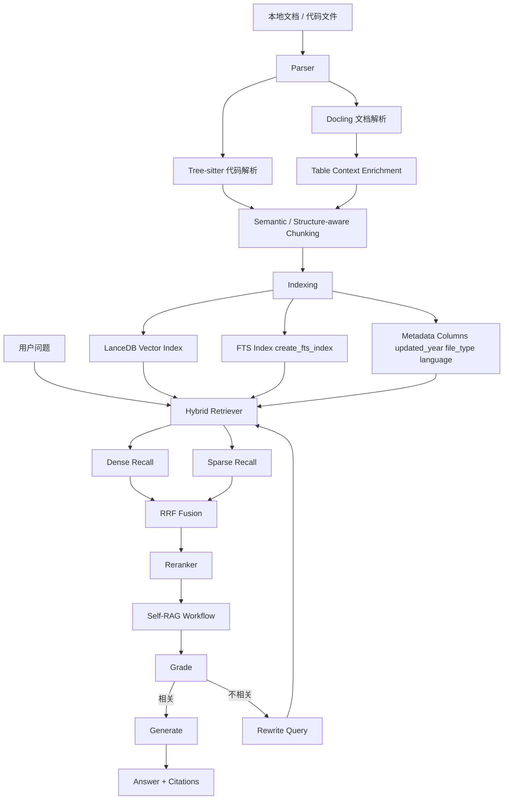

# NexusSearch

NexusSearch 是一个面向本地知识库场景的 Public RAG 项目，目标不是做一个“能问答”的最小 Demo，而是做一个能写进简历、能被面试官快速看懂、也能继续演进成产品原型的工程化系统。

## 项目亮点

- ✅ 高保真文档解析：基于 `Docling` 解析 PDF / DOCX / HTML，并对 Markdown Table 做上下文增强
- ✅ 代码感知解析：基于 `Tree-sitter` 对代码文件做语法级切分，回退到正则策略时也能工作
- ✅ 语义切块：支持结构化切块与 Embedding 驱动的 Semantic Chunking
- ✅ 混合检索：`LanceDB` 向量检索 + `FTS/BM25` 全文检索
- ✅ RRF 融合：使用 `Reciprocal Rank Fusion` 统一不同量纲的召回分数
- ✅ Agentic Self-RAG：支持 `retrieve -> grade -> rewrite -> generate` 循环
- ✅ Metadata 过滤：支持按年份、文件类型、语言、路径子串过滤结果
- ✅ 本地推理：默认适配 `Ollama`，便于本地离线演示
- ✅ SSE 流式输出：FastAPI 提供标准 `text/event-stream` 接口
- ✅ RAGAS 评估：支持 `Faithfulness` 与 `Context Recall` 指标
- ✅ 桌面端 GUI：支持路径选择、建库、问答与设置中心，便于打包为 `exe`

## 架构图



## 为什么这个项目比普通 RAG Demo 更强

大多数本地 RAG 项目只做了三件事：读取 PDF、固定长度切块、向量检索。NexusSearch 则把真正影响效果的细节前置了：

- 输入质量：Docling 能更稳定地保留表格、版式和复杂文档结构
- Chunk 质量：不仅保留标题层级，还会在表格块中补充前后文，降低模型“只看到表格不知道在说什么”的风险
- 检索质量：Dense 与 Sparse 分数不在同一量纲，直接相加不合理，RRF 正是工业界常用的稳健融合方案
- 流程质量：Self-RAG 不把第一次检索当成最终结果，而是允许模型先判断“取回来的内容够不够回答”

## 当前技术栈

- 文档解析：`Docling`
- 代码解析：`Tree-sitter` / `tree-sitter-languages`
- 向量库：`LanceDB`
- Embedding：默认 `BAAI/bge-m3`
- Reranker：默认 `BAAI/bge-reranker-v2-m3`
- 编排框架：`LangGraph`（可选）+ 本地 Self-RAG 回退实现
- 推理引擎：`Ollama`
- API：`FastAPI`
- CLI：`Typer`

## 关键实现细节

### 1. Table Context Enrichment

对于解析后的 Markdown 文档，系统会识别表格块，并自动把表格前后的最近语义段落一起拼接进该块。这样即使遇到跨页表格或孤立表格，检索和生成阶段也能拿到更完整的上下文。

### 2. LanceDB FTS

索引阶段会显式调用 `create_fts_index("text")`，保证向量召回之外还有全文检索通道，适合处理实体名、版本号、参数名这类关键词搜索。

### 3. Metadata Filter

索引写入时会额外存储：

- `updated_year`
- `updated_at`
- `file_type`
- `language`
- `chunk_kind`

查询时可以直接过滤，例如：

```bash
python main.py query "性能优化策略" --year-from 2025 --file-type document
```

### 4. RRF 融合

项目中的 RRF 逻辑位于 [retriever.py](d:/AllProject/PythonProject/NexusSearch/core/retriever.py)，核心思路就是对每个召回列表按排名倒数加权，而不是直接混合原始分数。这样可以天然规避 Dense Score 和 Sparse Score 量纲不一致的问题。

## 快速开始

### 1. 准备本地模型

```bash
ollama run deepseek-r1:7b
```

如果你想继续使用默认配置里的 Qwen，也可以：

```bash
ollama run qwen2.5:7b-instruct
```

### 2. 创建环境并安装依赖

```bash
conda env create -f environment.yml
conda activate NexusSearch
pip install -r requirements.txt
```

### 3. 建立索引

```bash
python main.py ingest data --overwrite
```

### 4. 发起查询

```bash
python main.py query "这个系统如何解决 Dense 和 Sparse 分数量纲不同的问题？" --workflow self-rag
```

### 5. 启动 API

```bash
python main.py serve --host 127.0.0.1 --port 8000
```

### 6. 启动桌面端

```bash
python main.py desktop
```

### 7. 运行评估

```bash
python main.py evaluate eval/sample_eval.jsonl --output reports/ragas_eval.json
```

### 8. 打包为 exe

```bash
powershell -ExecutionPolicy Bypass -File scripts/build_desktop.ps1
```

## API 示例

`POST /query`

```json
{
  "query": "只看 2025 年以后的文档，系统的检索策略是什么？",
  "workflow": "self-rag",
  "year_from": 2025,
  "file_type": "document",
  "top_k": 6,
  "candidate_k": 24,
  "rerank": true,
  "generate": true
}
```

`POST /query/stream`

返回标准 SSE 事件流，事件类型包括：

- `start`
- `retrieval`
- `context`
- `token`
- `final`
- `end`

## 仓库结构

```text
.
|-- api/
|   `-- server.py
|-- core/
|   |-- chunker.py
|   |-- config.py
|   |-- indexer.py
|   |-- llm.py
|   |-- parser.py
|   |-- retriever.py
|   |-- schemas.py
|   |-- service.py
|   `-- workflow.py
|-- tests/
|   |-- test_chunker.py
|   |-- test_parser.py
|   |-- test_parser_tables.py
|   |-- test_retriever_filters.py
|   |-- test_retriever_fusion.py
|   `-- test_workflow.py
|-- main.py
|-- requirements.txt
`-- environment.yml
```

## 简历描述建议

- 构建本地优先的开源 RAG 系统，集成 Docling、Tree-sitter、LanceDB、BGE-M3 与 Self-RAG 工作流。
- 设计并实现 Hybrid Retrieval + RRF 融合 + Reranker 精排链路，提升复杂文档检索稳定性。
- 为表格解析补充上下文增强，并支持基于年份、文件类型、语言等元数据的查询过滤。

## 后续可继续增强

- `vLLM` 推理后端
- `Next.js` 搜索界面
